# m.tix 2.0 - Movie Ticketing & Concessions App UI

A redesigned user interface for a movie ticketing and in-cinema concessions ordering application. It showcases the primary flows for browsing movies, viewing reviews, checking order history, managing account settings, and selecting payment methods.

### 🏠 Homepage

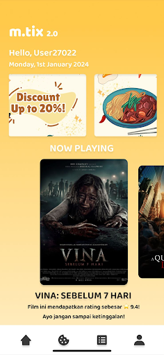 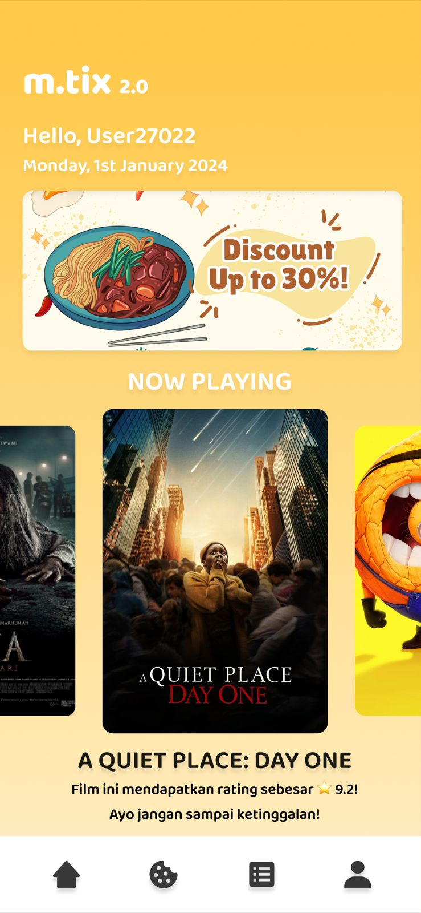 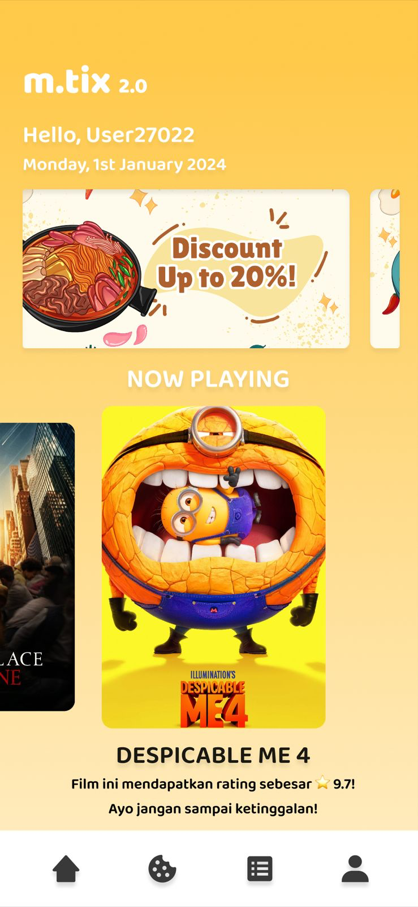

### 🍿 Food & Drinks Menu

  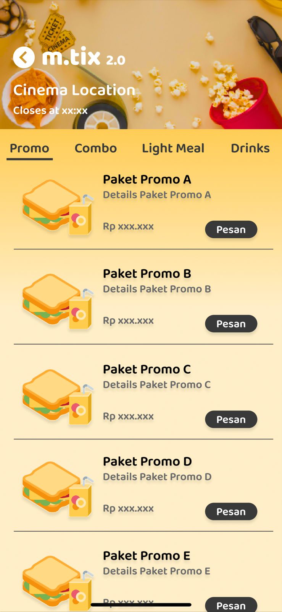
  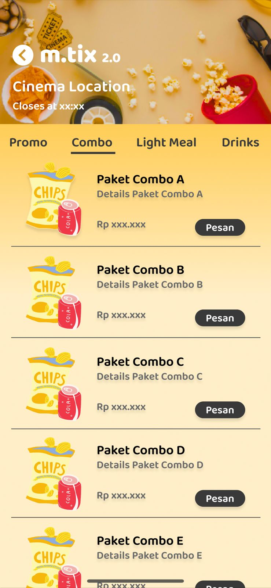

  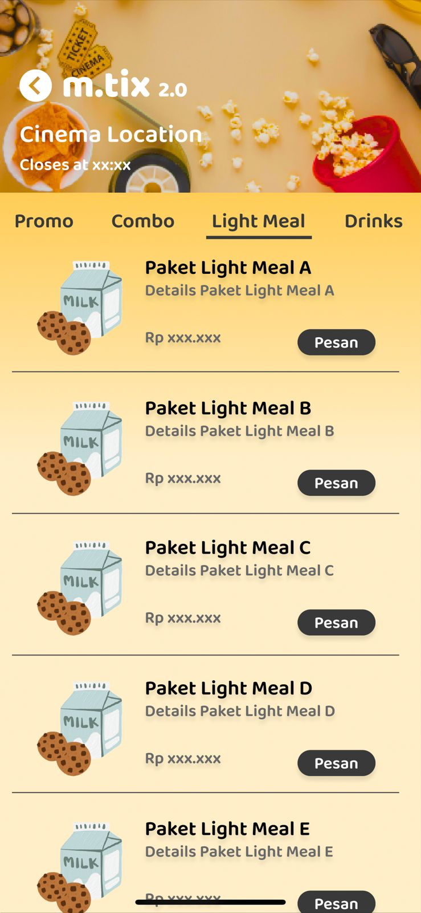
  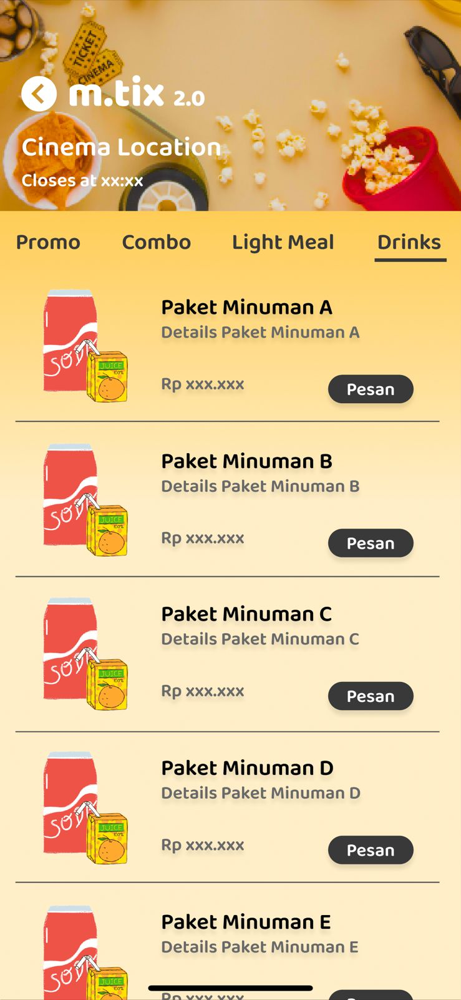

### 📝 Movie Reviews 
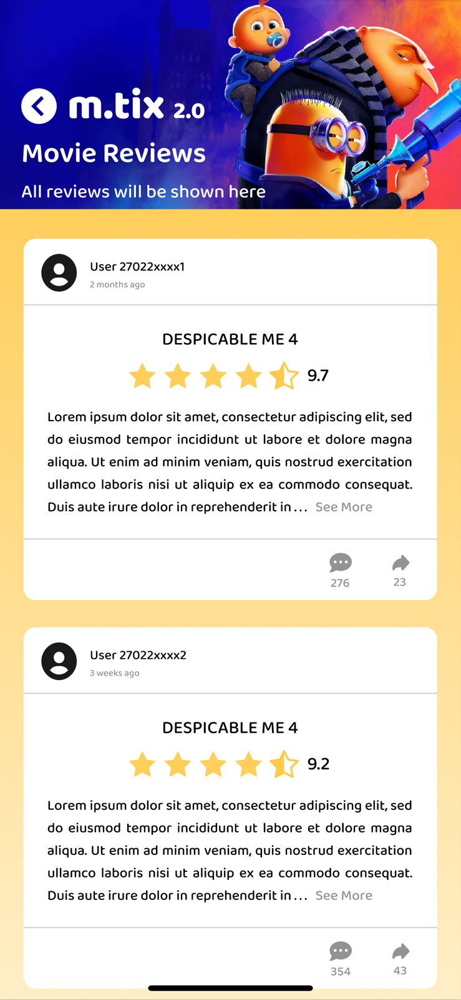 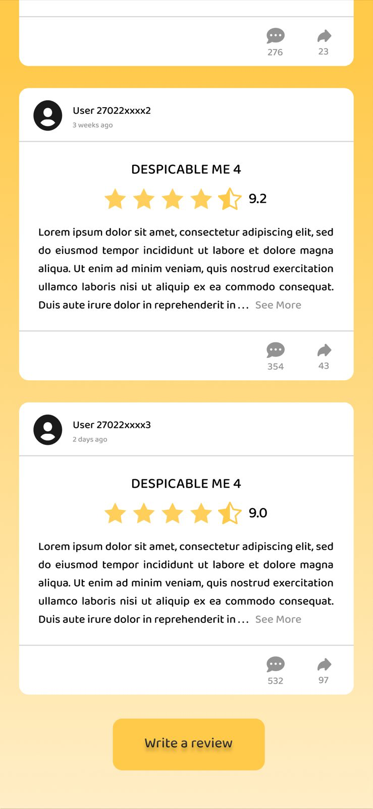 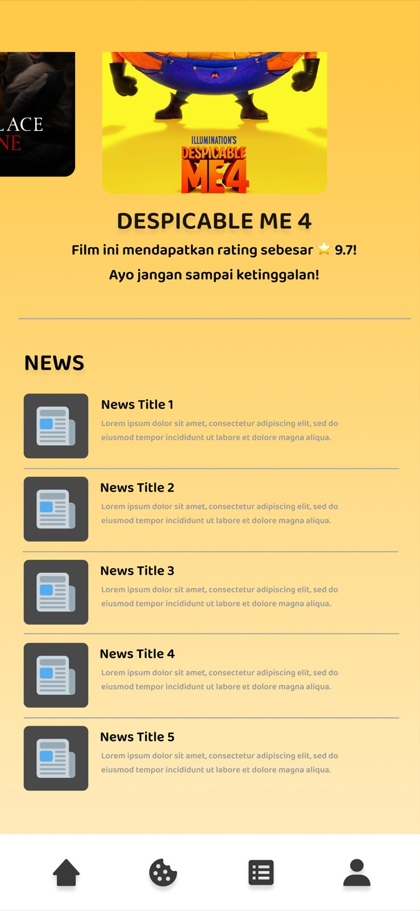

### 🧾 Order History 
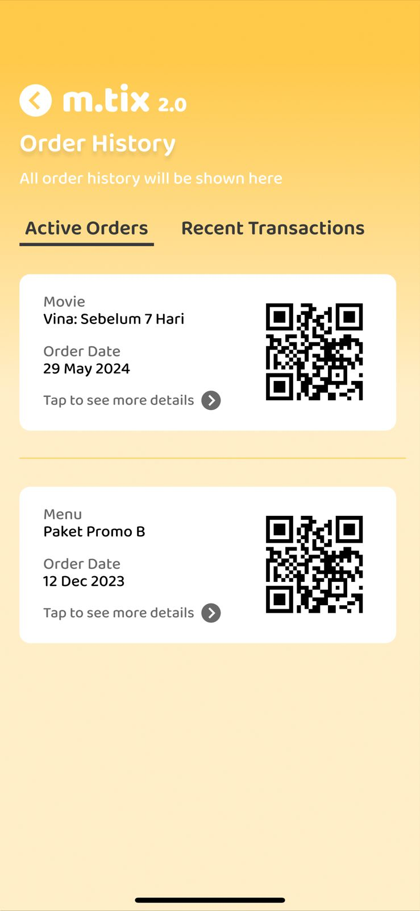 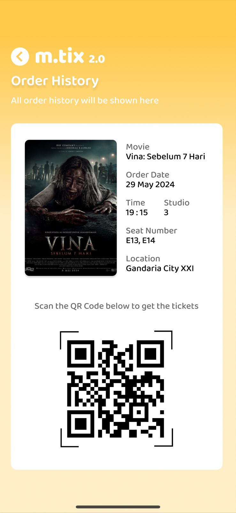 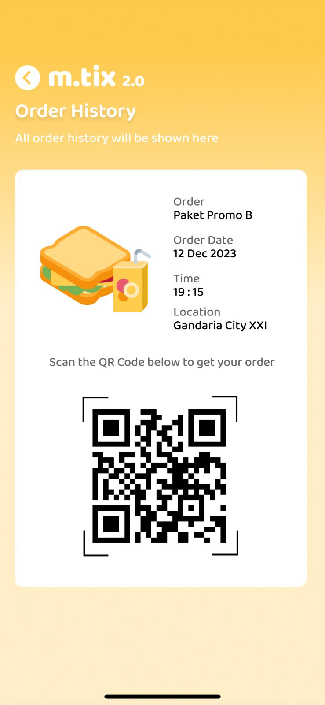
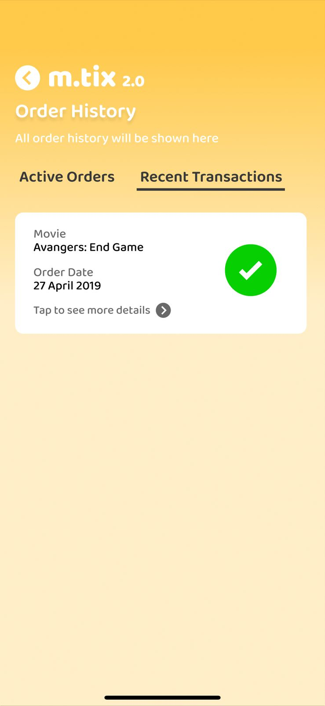 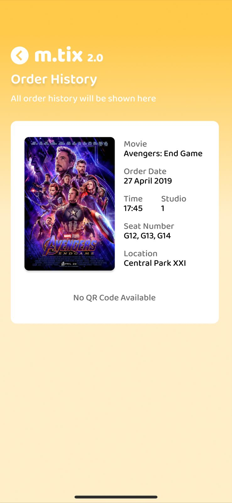 
### 👤 Account Management 
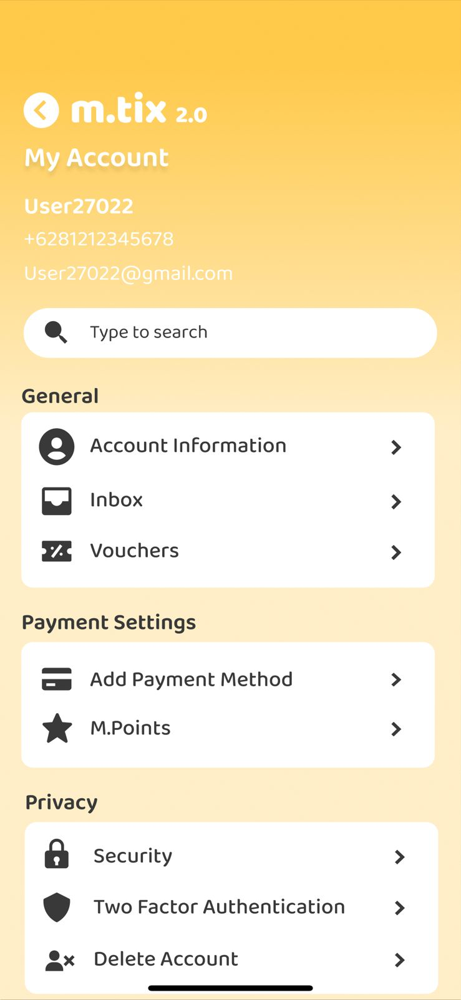 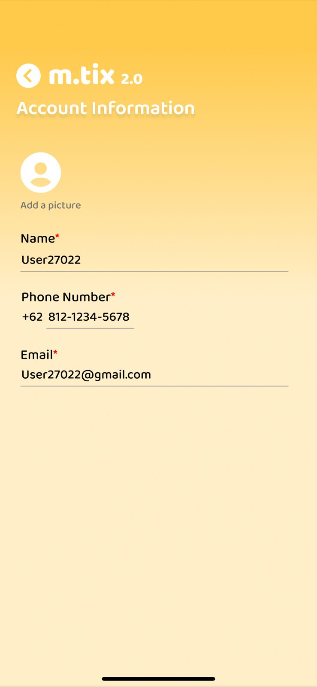 

### 💳 Payment Methods 
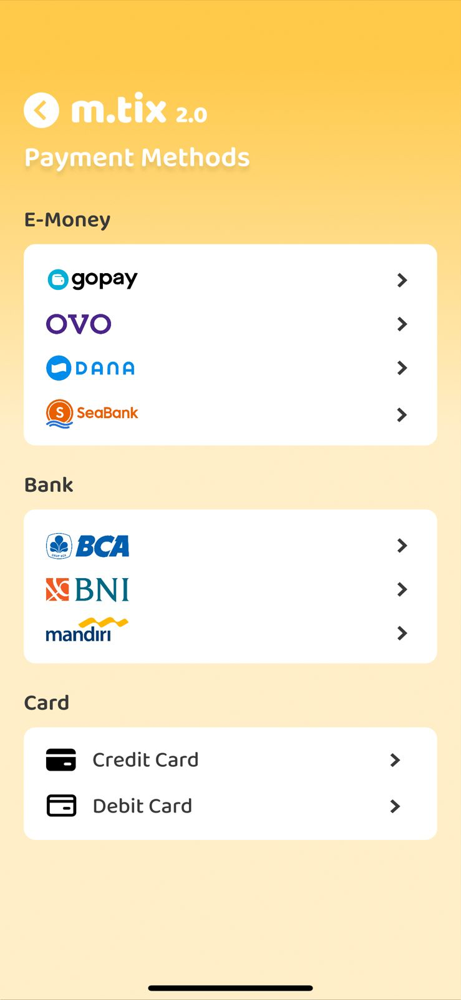  

## ✨ Features

The application interface covers the following key functionalities:
. Home Page
The Home Page (index.html) is designed to be rich with information and features:

[cite_start]

Promotional Banner Carousel: Displays various current food and beverage promotions and discounts.   

[cite_start]

Now Playing Film Carousel: A horizontally scrollable list of current movies, providing information like the movie title and its rating.   

[cite_start]

Movie Review Integration: Tapping a movie poster redirects the user to the dedicated review page where they can read existing reviews and submit their own rating and review.   

[cite_start]

News Section: A scrollable section at the bottom of the page that displays news related to films that are current, upcoming, or have already aired.   

[cite_start]

Persistent Navigation Bar: A sticky bottom navigation bar allowing easy access to the Home, Food and Beverage, Order, and Settings pages.   

2. Food Order Page
The Food Order Page (food.html) facilitates the purchase of cinema concessions:

[cite_start]

Location Information: Displays the cinema location and its closing time.   

[cite_start]

Tabbed Menu Categories: The menu is organized into navigable tabs: Promo, Combo, Light Meal, and Drinks.   

[cite_start]

Product Details: Each menu item displays its name (e.g., Paket Promo A), description, price (Rp xxx.xxx), and a "Pesan" (Order) button.   

3. Order History Page
The Order History Page (orderhistory.html) organizes user transactions:

[cite_start]

Tabbed History: Orders are separated into two distinct tabs:   

[cite_start]

Active Orders: Shows current, active, or pending orders, which can be movie tickets, food, or drinks.   

[cite_start]Each active order includes a 

QR Code for quick retrieval or ticket scanning.   

[cite_start]

Recent Transactions: Displays the history of all completed transactions.   

[cite_start]

Detailed Order View: Users can view details for each transaction, including the order date, time, seat number (for movies), and cinema location.   

4. My Account Page
The My Account Page (account.html) is the hub for user settings and profile management:

[cite_start]

General Account Overview: Displays the user's name, phone number, and email upon entry.   

[cite_start]

Search Functionality: A dedicated input box for searching within the account menu.   

## 🛠️ Technologies Used

* **HTML5**
* **CSS3** (Custom stylesheets for all pages)
* **JavaScript** (Vanilla JS for interactive elements like carousels, tabs, and modals)
* **External Libraries:**
    * [Google Fonts](https://fonts.googleapis.com/css2?family=Baloo+Bhai+2:wght@400..800&display=swap) (`Baloo Bhai 2` font)
    * [Font Awesome](https://cdnjs.cloudflare.com/ajax/libs/font-awesome/6.5.2/css/all.min.css) (Icons for menus and buttons)
    * [SweetAlert2](https://cdn.jsdelivr.net/npm/sweetalert2@11) (For alert/confirmation messages in review submission)

